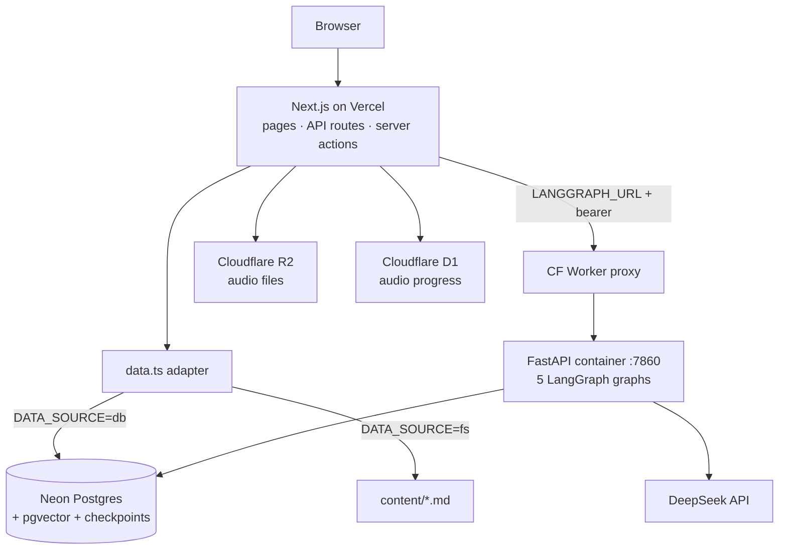

<div align="center">

<br />

# 🧠 &nbsp; AI Engineering

### From Zero to Production AI Engineer

**A hands-on learning platform that takes engineers from transformer internals to shipping production AI systems.**

108 deeply-researched lessons across 15 categories — RAG, agents, evals, fine-tuning, prompting — wired together with semantic search, AI audio narration, an interactive knowledge graph, a RAG tutor, and per-learner mastery analytics.

<br />

[](https://nextjs.org/)
[](https://www.typescriptlang.org/)
[](https://langchain-ai.github.io/langgraph/)
[](https://neon.tech/)
[](https://vercel.com/)

<br />

**[🚀 Quick Start](#-quick-start)** &nbsp;·&nbsp; **[✨ Features](#-features)** &nbsp;·&nbsp; **[🧱 Stack](#-stack)** &nbsp;·&nbsp; **[🏗 Architecture](#-architecture)** &nbsp;·&nbsp; **[🛠 Dev](#-dev)**

<sub>**108** lessons &nbsp;·&nbsp; **15** categories &nbsp;·&nbsp; **5** LangGraph graphs &nbsp;·&nbsp; **22** DB tables &nbsp;·&nbsp; **10** course evaluators</sub>

</div>

---

## ✨ Features

| | Feature | What it does |
|:--:|---|---|
| 📚 | **108 lessons, 15 categories** | Curriculum from transformer internals → RAG → agents → evals → production, prerequisite-ordered. |
| 🔎 | **Semantic + full-text search** | `Cmd+K` instant search over Postgres FTS *and* pgvector cosine similarity. |
| 🎧 | **Audio narration** | TTS audio per lesson (Rust pipeline → Cloudflare R2) with per-user resume positions in D1. |
| 🕸️ | **Knowledge graph** | Concepts linked by `prerequisite` / `builds_on` / `related` edges, rendered as an explorable graph. |
| 🤖 | **AI tutor chat** | RAG chat grounded in lesson content, with intent routing and checkpointed threads. |
| 📈 | **Mastery analytics** | Bayesian Knowledge Tracing (`mastery / transit / slip / guess`) per learner per lesson. |
| ✍️ | **Self-authoring** | A 5-pass LangGraph writer (research → outline → draft → review → revise) generates new lessons behind a quality gate. |
| 🎓 | **Course reviewer** | 10 expert evaluators score & rank external AI courses concurrently. |

## 🚀 Quick Start

> **Prerequisites:** Node 22.x · pnpm · a Neon Postgres database

```bash
pnpm install
cp .env.example .env.local   # fill in the keys (see Environment below)

pnpm db:push                 # sync schema to Neon
pnpm seed                    # seed 108 lessons from content/*.md
pnpm dev                     # → http://localhost:3006  🎉
```

That's the full read-only app — search, audio, knowledge graph, and analytics all work without a backend. For AI features (chat, article / flashcard / course-review generation), also run the [LangGraph backend](#langgraph-backend).

## 🧱 Stack

| Layer | Technology |
|---|---|
| **Framework** | Next.js 15 (App Router, Turbopack) |
| **Database** | Neon PostgreSQL + pgvector, Drizzle ORM |
| **UI** | Radix UI Themes |
| **AI / LLM** | OpenAI · DeepSeek |
| **AI backend** | Python FastAPI + LangGraph on Cloudflare Containers — 5 graphs (`chat`, `app_prep`, `memorize_generate`, `article_generate`, `course_review`) with `AsyncPostgresSaver` checkpointing |
| **Storage** | Cloudflare R2 (audio) · D1 (per-user playback state) |
| **Deployment** | Vercel (frontend) + Cloudflare Containers (backend) |

## 🏗 Architecture



**Request paths:** lesson pages read through `data.ts` (DB or filesystem) and pull related lessons via pgvector cosine similarity. Chat does FTS + vector retrieval in Next.js, then POSTs snippets + history to the LangGraph container, which calls DeepSeek and persists the thread.

## 🔀 LangGraph Pipelines

- **Content generation** (`article_generate`) — research → outline → draft → review → revise, with a conditional revision loop (max 2) gated on word count, code blocks, cross-refs, ≥5 xyflow diagrams, and mandatory sections. Runs in pure Python in-process (no HTTP).
- **RAG chat** (`chat`) — classify intent (keyword vs. conceptual) → retrieve (FTS / vector / hybrid) → format context → generate.
- **Course review** (`course_review`) — 10 expert evaluators run concurrently via `asyncio.gather`, then a weighted aggregator computes score + verdict.

## 🗂 Project Layout

```
app/                  Next.js App Router (lessons, AWS hub, applications, coursework, problems, api/*)
components/           React components (search, audio-player, toc, …)
content/              Markdown lesson files
src/db/               Neon client + Drizzle schema (22 tables)
src/lib/              langgraph-client (typed POST /runs/wait)
lib/                  data.ts adapter, db queries, r2.ts, d1.ts, server actions
backend/              Python FastAPI + LangGraph (5 graphs, pytest + deepeval, wrangler)
scripts/              seed, scrape, review-courses, e2e
sql/ · migrations/    Neon setup + D1 migrations
```

## 🛠 Dev

```bash
pnpm dev                       # start on :3006
pnpm db:push / db:studio       # sync schema / open Drizzle Studio
pnpm seed / seed:courses       # seed lessons / Udemy catalog
pnpm scrape:udemy              # scrape AI/ML Udemy topics → external_courses

pnpm generate <slug>           # generate a lesson via LangGraph
pnpm generate:dry <slug>       # preview without saving
pnpm generate:batch            # generate all missing lessons
pnpm review:courses            # batch-review unreviewed courses

pnpm backend:dev               # uvicorn --reload on :7860 (needs backend/.env)
pnpm backend:deploy            # wrangler deploy from backend/

pnpm test:backend              # pytest (stubbed graphs, no LLM/DB)
pnpm test:e2e                  # smoke the deployed worker
pnpm test:deepeval             # LLM-judge gate on chat + app_prep (~$0.05)
pnpm test:deepeval:all         # + course_review + article_generate (~$0.20)
```

**DeepEval gate:** each of the 4 LLM-driven graphs has a 5-case golden set judged by an aggregate pass-rate gate (currently `0.65`, the empirical floor for DeepSeek-judged 5-case goldens). Excluded from `pnpm test:backend` by default; opt in via `pnpm test:deepeval*`.

### LangGraph backend

```bash
cd backend
python -m venv .venv && source .venv/bin/activate
pip install -r requirements.txt
uvicorn app:app --port 7860 --reload          # or: docker build / docker run

wrangler deploy                                # deploy to Cloudflare Containers
wrangler secret put DATABASE_URL DEEPSEEK_API_KEY LANGGRAPH_AUTH_TOKEN
```

Once deployed, set `LANGGRAPH_URL` + `LANGGRAPH_AUTH_TOKEN` in the Vercel environment so `/api/chat` and the prep / memorize routes reach the container. First-time pytest setup uses an isolated venv: `cd backend && python3.12 -m venv .venv && .venv/bin/pip install -r requirements-dev.txt`.

### Environment

```env
DATABASE_URL=             # Neon connection string (also used by backend container)
OPENAI_API_KEY=
DEEPSEEK_API_KEY=
LANGGRAPH_URL=            # http://127.0.0.1:7860 locally; workers.dev URL in prod
LANGGRAPH_AUTH_TOKEN=     # bearer token shared between Next.js and backend
NEXT_PUBLIC_DATA_SOURCE=  # "db" | "fs"
NEXT_PUBLIC_R2_DOMAIN=    # audio CDN domain
R2_ACCOUNT_ID= R2_ACCESS_KEY_ID= R2_SECRET_ACCESS_KEY= R2_BUCKET_NAME=
CLOUDFLARE_ACCOUNT_ID= CLOUDFLARE_AUDIO_D1_ID= CLOUDFLARE_D1_API_TOKEN=
```

---

<div align="center">

### Built with Next.js 15 · LangGraph · Neon pgvector · Cloudflare

<sub>From zero to production AI engineer — one lesson at a time.</sub>

[⬆ Back to top](#--ai-engineering)

</div>
